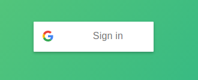
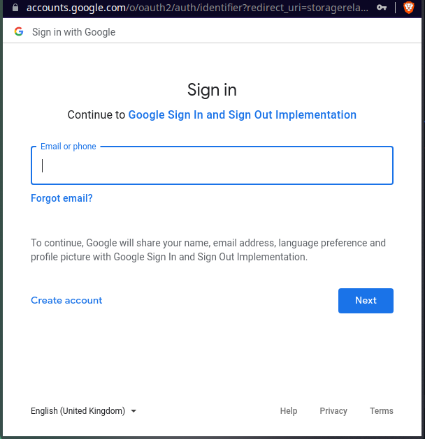
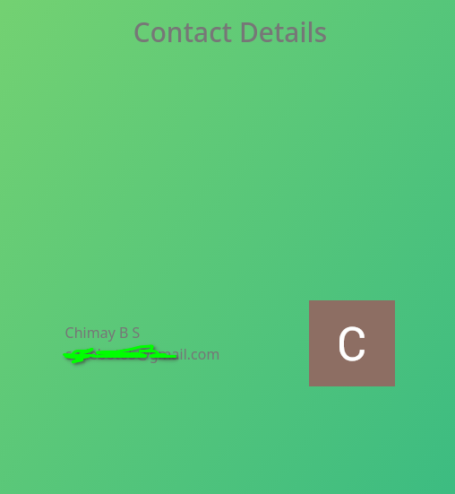
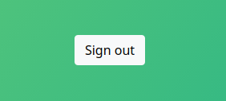

<h1 align="center">Task-02 SIGN UP USING GOOGLE ACCOUNT</h1>
 
 

## Functionalities
 

- Sign in using google account
- Displaying your credentials(name,email and profile pic)
- Sign Out 
 
 

 There is a button with google logo and a text sign in click on that button.
Then a window will pop up asking your google account for sign in. Enter your credentials, then your details(name, gmail, and photo) will be displayed.
If you want to sign out from this site. click on the button sign out.

 
 

### Sign in Button
 

 

 
 

### pop up window
 

 

 
 

### Account Details
 

 

 
 

### Sign out button
 

 

 
 
